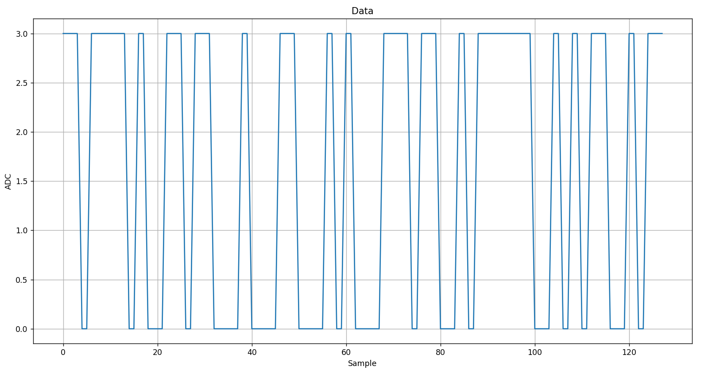

# oscilloscope-project

## Описание проекта

Этот проект представляет собой простой цифровой осциллограф,
который использует микроконтроллер STM32 и Arduino UNO для генерации сигнала.

Проект включает в себя следующие шаги:

1. Генерация сигнала на Arduino UNO.
2. Передача сигнала по UART.
3. Прием сигнала на вход АЦП.
4. Считывание сигнала с АЦП на STM32.
5. Сохранение данных в памяти STM32.
6. Передача данных через UART2 на ПК.
7. Отображение данных на ПК с помощью Python и matplotlib.

## Как запустить проект

### Arduino UNO:

Загрузить код signal_generator.ino на Arduino UNO с помощью Arduino IDE.

### STM32:

Загрузить код из директории Oscilloscope на микроконтроллер STM32 с помощью STM32CubeIDE.

### Python:

Установить модули pyserial и matplotlib: pip install pyserial matplotlib

Запустить скрипт main.py

## Подключение

### Подключение Arduino UNO к STM32:

1. Подключить выход Arduino TX к входу STM32 пин PA0.
2. Подключить пин GND Arduino UNO и пин GND STM32.

## Результат работы программы
